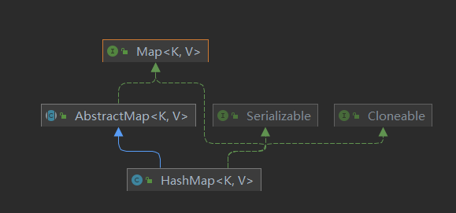

#  HashMap源码分析（基于java8）

##  一.简介

### 1.介绍

**HashMap**是java里面以Key-value存储的一种集合对象,它使用的是数组加上链表的结构,它允许key和value为**null**,是一种**无序**并且**线程不安全**的集合对象。

###  2.类结构



### 3.数据结构

在 JDK1.8 中，HashMap 是由 数组+链表+红黑树构成，相比于1.7新增了红黑树作为底层数据结构。


其底层采用Node[] table存储，即哈希桶数组。

```java
    /**
     * The table, initialized on first use, and resized as
     * necessary. When allocated, length is always a power of two.
     * (We also tolerate length zero in some operations to allow
     * bootstrapping mechanics that are currently not needed.)
     */
    transient Node<K,V>[] table;
```

Node：

```java
static class Node<K,V> implements Map.Entry<K,V> {
        final int hash;
        final K key;
        V value;
        Node<K,V> next;

        Node(int hash, K key, V value, Node<K,V> next) {}

        public final K getKey()        { return key; }
        public final V getValue()      { return value; }
        public final String toString() { return key + "=" + value; }

        public final int hashCode() {
            return Objects.hashCode(key) ^ Objects.hashCode(value);
        }

        public final V setValue(V newValue) {}

        public final boolean equals(Object o) {
            if (o == this)
                return true;
            if (o instanceof Map.Entry) {
                Map.Entry<?,?> e = (Map.Entry<?,?>)o;
                if (Objects.equals(key, e.getKey()) &&
                    Objects.equals(value, e.getValue()))
                    return true;
            }
            return false;
        }
    }
```

Node是HashMap的一个内部类，实现了Map.Entry接口，本质是就是一个映射(键值对).

## 二.属性

```java

    /**
     * The default initial capacity - MUST be a power of two.
     */
    static final int DEFAULT_INITIAL_CAPACITY = 1 << 4; // aka 16

    /**
     * The maximum capacity, used if a higher value is implicitly specified
     * by either of the constructors with arguments.
     * MUST be a power of two <= 1<<30.
     */
    static final int MAXIMUM_CAPACITY = 1 << 30;

    /**
     * The load factor used when none specified in constructor.
     */
    static final float DEFAULT_LOAD_FACTOR = 0.75f;

	/**
     * Because TreeNodes are about twice the size of regular nodes, we
     * use them only when bins contain enough nodes to warrant use
     * (see TREEIFY_THRESHOLD). And when they become too small (due to
     * removal or resizing) they are converted back to plain bins.  In
     * usages with well-distributed user hashCodes, tree bins are
     * rarely used.  Ideally, under random hashCodes, the frequency of
     * nodes in bins follows a Poisson distribution
     * (http://en.wikipedia.org/wiki/Poisson_distribution) with a
     * parameter of about 0.5 on average for the default resizing
     * threshold of 0.75, although with a large variance because of
     * resizing granularity. Ignoring variance, the expected
     * occurrences of list size k are (exp(-0.5) * pow(0.5, k) /
     * factorial(k)). The first values are:
     *
     * 0:    0.60653066
     * 1:    0.30326533
     * 2:    0.07581633
     * 3:    0.01263606
     * 4:    0.00157952
     * 5:    0.00015795
     * 6:    0.00001316
     * 7:    0.00000094
     * 8:    0.00000006
     * more: less than 1 in ten million
     *
     */
    /**
     * The bin count threshold for using a tree rather than list for a
     * bin.  Bins are converted to trees when adding an element to a
     * bin with at least this many nodes. The value must be greater
     * than 2 and should be at least 8 to mesh with assumptions in
     * tree removal about conversion back to plain bins upon
     * shrinkage.
     */
    static final int TREEIFY_THRESHOLD = 8;

    /**
     * The bin count threshold for untreeifying a (split) bin during a
     * resize operation. Should be less than TREEIFY_THRESHOLD, and at
     * most 6 to mesh with shrinkage detection under removal.
     */
    static final int UNTREEIFY_THRESHOLD = 6;

    /**
     * The smallest table capacity for which bins may be treeified.
     * (Otherwise the table is resized if too many nodes in a bin.)
     * Should be at least 4 * TREEIFY_THRESHOLD to avoid conflicts
     * between resizing and treeification thresholds.
     */
    static final int MIN_TREEIFY_CAPACITY = 64;
```

##  三.方法

### 1.构造方法

#### 1.1 HashMap()

构造一个空的 HashMap，默认初始容量（16）和默认负载因子（0.75）。

```java

    /**
     * Constructs an empty <tt>HashMap</tt> with the default initial capacity
     * (16) and the default load factor (0.75).
     */
    public HashMap() {
        this.loadFactor = DEFAULT_LOAD_FACTOR; // all other fields defaulted
    }
```

####  1.2HashMap(int initialCapacity)

构造一个空的 HashMap具有指定的初始容量和默认负载因子（0.75）。

```java
/**
 * Constructs an empty <tt>HashMap</tt> with the specified initial
 * capacity and the default load factor (0.75).
 *
 * @param  initialCapacity the initial capacity.
 * @throws IllegalArgumentException if the initial capacity is negative.
 */
public HashMap(int initialCapacity) {
    this(initialCapacity, DEFAULT_LOAD_FACTOR);
}
```

####  1.3HashMap(int initialCapacity, float loadFactor)

构造一个空的 HashMap具有指定的初始容量和负载因子。

在构造方法中调用了tableSizeFor(),tableSizeFor方法是为了找到大于initialCapacity的最小的2的幂次的数

```java
/**
 * Constructs an empty <tt>HashMap</tt> with the specified initial
 * capacity and load factor.
 *
 * @param  initialCapacity the initial capacity
 * @param  loadFactor      the load factor
 * @throws IllegalArgumentException if the initial capacity is negative
 *         or the load factor is nonpositive
 */
public HashMap(int initialCapacity, float loadFactor) {
    if (initialCapacity < 0)
        throw new IllegalArgumentException("Illegal initial capacity: " +
                                           initialCapacity);
    if (initialCapacity > MAXIMUM_CAPACITY)
        initialCapacity = MAXIMUM_CAPACITY;
    if (loadFactor <= 0 || Float.isNaN(loadFactor))
        throw new IllegalArgumentException("Illegal load factor: " +
                                           loadFactor);
    this.loadFactor = loadFactor;
    this.threshold = tableSizeFor(initialCapacity);
}
```

```java
/**
 * Returns a power of two size for the given target capacity.
 */
static final int tableSizeFor(int cap) {
    int n = cap - 1;
    n |= n >>> 1;
    n |= n >>> 2;
    n |= n >>> 4;
    n |= n >>> 8;
    n |= n >>> 16;
    return (n < 0) ? 1 : (n >= MAXIMUM_CAPACITY) ? MAXIMUM_CAPACITY : n + 1;
}
```


为什么hashmap的容量要为2的幂次？

1.Hashmap在计算元素存储的位置时，采取的方法是取模，即hash(key) % length，但是在计算机中，取模的效率十分低，并且该运算在hashmap中十分常见（get(),put(),resize()），所以为了提高效率，源码中采用hash(key) & length-1来替代该运算（当length为2的幂次时才成立）。

2.便于扩容时计算扩容后的元素位置

3.length-1后是前面都为0后面都为1的二进制数，进行与运算时，即保证了结果不会超出数组的长度，也保证了每一位都起了作用（0&任何数=0，即不起作用）

### 2.hash()方法

```
/**
 * Computes key.hashCode() and spreads (XORs) higher bits of hash
 * to lower.  Because the table uses power-of-two masking, sets of
 * hashes that vary only in bits above the current mask will
 * always collide. (Among known examples are sets of Float keys
 * holding consecutive whole numbers in small tables.)  So we
 * apply a transform that spreads the impact of higher bits
 * downward. There is a tradeoff between speed, utility, and
 * quality of bit-spreading. Because many common sets of hashes
 * are already reasonably distributed (so don't benefit from
 * spreading), and because we use trees to handle large sets of
 * collisions in bins, we just XOR some shifted bits in the
 * cheapest possible way to reduce systematic lossage, as well as
 * to incorporate impact of the highest bits that would otherwise
 * never be used in index calculations because of table bounds.
 */
static final int hash(Object key) {
    int h;
    return (key == null) ? 0 : (h = key.hashCode()) ^ (h >>> 16);
}
```

HashMap的hash方法对key为null时做了处理，所以hashmap可以存储null。

在对key取hashcode后，还加入了扰动函数。试想当hashmap容量比较小时，如果没有加入扰动函数，则在进行hash(key) & length-1运算时，起作用的永远只有低位，增大了碰撞的可能，但通过扰动函数使hashcode自己的高半区和低半区做异或，就是为了混合原始哈希码的高位和低位，以此来加大低位的随机性。而且混合后的低位掺杂了高位的部分特征，这样高位的信息也被变相保留下来。


### 3.put

```java
final V putVal(int hash, K key, V value, boolean onlyIfAbsent,
               boolean evict) {
    Node<K,V>[] tab; Node<K,V> p; int n, i;
    // 如果table为空,或者没有结点,调用resize()方法进行扩容初始化,对应构造方法
    if ((tab = table) == null || (n = tab.length) == 0) 
        n = (tab = resize()).length;
    /**
     * (n - 1) & hash计算该结点的存储位置
     * 如果该位置还没有结点,就创建该结点为该位置头节点
     */
    if ((p = tab[i = (n - 1) & hash]) == null)
        tab[i] = newNode(hash, key, value, null);
    // 该位置已经有结点,则需要处理碰撞
    else {
        Node<K,V> e; K k;
        // 该位置结点的key和传入结点的key相同,则先记录
        if (p.hash == hash &&
            ((k = p.key) == key || (key != null && key.equals(k))))
            e = p;
        // 如果该位置节点类型为红黑树,则按照红黑树的方法进行添加
        else if (p instanceof TreeNode)
            e = ((TreeNode<K,V>)p).putTreeVal(this, tab, hash, key, value);
        // 到这里则首节点为链表类型,需要进行拉链
        else {
            for (int binCount = 0; ; ++binCount) {
                // 当遍历到末尾时,在末尾添加传入的结点
                if ((e = p.next) == null) {
                    p.next = newNode(hash, key, value, null);
                    // 当遍历节点数大于8, 转化为红黑树
                    if (binCount >= TREEIFY_THRESHOLD - 1) // -1 for 1st
                        treeifyBin(tab, hash);
                    break;
                }
                // 如果找到与待插入结点相同的key的结点,则跳出遍历,此时e已经记录了该节点
                if (e.hash == hash &&
                    ((k = e.key) == key || (key != null && key.equals(k))))
                    break;
                p = e;
            }
        }
        // 如果存在与待插入结点相同值的key的结点,判断是否进行修改
        if (e != null) { // existing mapping for key
            V oldValue = e.value;
            if (!onlyIfAbsent || oldValue == null)
                e.value = value;
            afterNodeAccess(e);
            return oldValue;
        }
    }
    ++modCount;
    // 当节点数达到threshold,进行扩容
    if (++size > threshold)
        resize();
    afterNodeInsertion(evict);
    return null;
}
```

### 4.resize

```java
final Node<K,V>[] resize() {
    // 旧数组
    Node<K,V>[] oldTab = table;
    // 旧数组容量
    int oldCap = (oldTab == null) ? 0 : oldTab.length;
    // 旧threshold
    int oldThr = threshold;
    int newCap, newThr = 0;
    // 旧数组已经初始化
    if (oldCap > 0) {
        // 判断容量是否已经达到最大值
        if (oldCap >= MAXIMUM_CAPACITY) {
            // 如果已经达到最大值,则修改threshold为0x7fffffff,不会再扩容
            threshold = Integer.MAX_VALUE;
            return oldTab;
        }
        // 如果原数组长度大于等于初始化长度16,并且2倍扩容后小于最大容量
        else if ((newCap = oldCap << 1) < MAXIMUM_CAPACITY &&
                 oldCap >= DEFAULT_INITIAL_CAPACITY)
            // 阈值扩大1倍
            newThr = oldThr << 1; // double threshold
    }
    // 数组还没有初始化,即只调用了构造方法HashMap(int initialCapacity)或者HashMap(int initialCapacity, float loadFactor)
    else if (oldThr > 0) // initial capacity was placed in threshold
        // 直接将阈值赋给新容量
        newCap = oldThr;
    // 数组还没有初始化,即只调用了构造方法HashMap()
    else {               // zero initial threshold signifies using defaults
        // 直接赋给默认值16,0.75
        newCap = DEFAULT_INITIAL_CAPACITY;
        newThr = (int)(DEFAULT_LOAD_FACTOR * DEFAULT_INITIAL_CAPACITY);
    }
    // 如果新的阈值为0
    // 这里只有2种情况能够达到
    // 1.已经初始化,并且扩容后容量大于最大值
    // 2.已经初始化,并且旧的容量小于默认值16
    if (newThr == 0) {
        float ft = (float)newCap * loadFactor;
        // 新的容量和新的阈值都小于最大容量,则赋予新的阈值
        // 否则为0x7fffffff,不会再扩容
        newThr = (newCap < MAXIMUM_CAPACITY && ft < (float)MAXIMUM_CAPACITY ?
                  (int)ft : Integer.MAX_VALUE);
    }
    threshold = newThr;
    // 创建新容量的table
    @SuppressWarnings({"rawtypes","unchecked"})
    Node<K,V>[] newTab = (Node<K,V>[])new Node[newCap];
    table = newTab;
    // 如果旧的table不为null,需要对原先的元素重新复制到新的table
    if (oldTab != null) {
        for (int j = 0; j < oldCap; ++j) {
            Node<K,V> e;
            // 该位置的结点不为null
            if ((e = oldTab[j]) != null) {
                // 原来的结点赋为null,便于GC
                oldTab[j] = null;
                // 该结点没有下一个结点
                if (e.next == null)
                    // 计算该节点在新的table里面的位置,并存放
                    newTab[e.hash & (newCap - 1)] = e;
                // 如果是红黑树结点,则调用红黑树方法
                else if (e instanceof TreeNode)
                    ((TreeNode<K,V>)e).split(this, newTab, j, oldCap);
                // 该结点为链表结构
                else { // preserve order
                    //构建了4个指针,主要是为了后续的构建lo链表和hi链表
                    Node<K,V> loHead = null, loTail = null;
                    Node<K,V> hiHead = null, hiTail = null;
                    Node<K,V> next;
                    do {
                        next = e.next;
                        /**
                         * 这里在计算结点在新的数组里面的位置的时候
                         * 直接与旧数组的容量进行与运算,如果结果为0,则结点在新数组中的位置不变,否则新的位置为旧位置+旧容量
                         * 因为确定位置的函数为hash(key) & (cap - 1)
                         * 结点在旧数组中位置为hash(key) & (oldCap - 1),新数组为hash(key) & (2 * oldCap - 1)
                         * (2 * oldCap - 1)只是比(oldCap - 1)在oldCap的位置上多了一位1
                         * 所以如果该结点在oldCap这一位上为0,则计算后的结果不会发生改变,则在新数组中位置不变,加入lo链表
                         * 如果该结点在oldCap这一位上为1,则计算后的结果为原先的位置 + oldCap,加入hi链表
                         */
                        if ((e.hash & oldCap) == 0) {
                            if (loTail == null)
                                loHead = e;
                            else
                                loTail.next = e;
                            loTail = e;
                        }
                        else {
                            if (hiTail == null)
                                hiHead = e;
                            else
                                hiTail.next = e;
                            hiTail = e;
                        }
                    } while ((e = next) != null);
                    // 将lo、hi链表存入新数组
                    if (loTail != null) {
                        loTail.next = null;
                        newTab[j] = loHead;
                    }
                    if (hiTail != null) {
                        hiTail.next = null;
                        newTab[j + oldCap] = hiHead;
                    }
                }
            }
        }
    }
    return newTab;
}
```


### 5. get

```java
final Node<K,V> getNode(int hash, Object key) {
    Node<K,V>[] tab; Node<K,V> first, e; int n; K k;
    // 旧容量不为0,并且该位置结点不为null
    if ((tab = table) != null && (n = tab.length) > 0 &&
        (first = tab[(n - 1) & hash]) != null) {
        // 如果相等,则返回
        if (first.hash == hash && // always check first node
            ((k = first.key) == key || (key != null && key.equals(k))))
            return first;
        // 如果是链表或者红黑树
        if ((e = first.next) != null) {
            if (first instanceof TreeNode)
                return ((TreeNode<K,V>)first).getTreeNode(hash, key);
            do {
                // 如果相等,则返回
                if (e.hash == hash &&
                    ((k = e.key) == key || (key != null && key.equals(k))))
                    return e;
            } while ((e = e.next) != null);
        }
    }
    return null;
}
```

### 6.remove

```java
final Node<K,V> removeNode(int hash, Object key, Object value,
                           boolean matchValue, boolean movable) {
    Node<K,V>[] tab; Node<K,V> p; int n, index;
    // 如果数组不为null,且容量不为空,则根据hash找到位置
    if ((tab = table) != null && (n = tab.length) > 0 &&
        (p = tab[index = (n - 1) & hash]) != null) {
        Node<K,V> node = null, e; K k; V v;
        // 如果第一个结点与传入key相等,则记录
        if (p.hash == hash &&
            ((k = p.key) == key || (key != null && key.equals(k))))
            node = p;
        // 如果不相等,且存在下一个结点
        else if ((e = p.next) != null) {
            // 调用红黑树方法
            if (p instanceof TreeNode)
                node = ((TreeNode<K,V>)p).getTreeNode(hash, key);
            else {
                // 循环链表,找到相等的结点记录
                do {
                    if (e.hash == hash &&
                        ((k = e.key) == key ||
                         (key != null && key.equals(k)))) {
                        node = e;
                        break;
                    }
                    p = e;
                } while ((e = e.next) != null);
            }
        }
        // 删除结点
        if (node != null && (!matchValue || (v = node.value) == value ||
                             (value != null && value.equals(v)))) {
            // 红黑树删除
            if (node instanceof TreeNode)
                ((TreeNode<K,V>)node).removeTreeNode(this, tab, movable);
            // 链表删除
            else if (node == p)
                tab[index] = node.next;
            else
                p.next = node.next;
            ++modCount;
            --size;
            afterNodeRemoval(node);
            return node;
        }
    }
    return null;
}
```